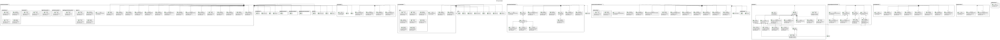

# EPD Type III Submodel UML Documentation

## Purpose
The UML diagrams provide a structural overview of the EPD Type III AAS submodel.

## Source of Truth
> **Note:** The UML source and rendered diagrams are generated from the same model definition used to create the EPD Type III AAS template (`model/template/epd-type-iii-submodel-template.aasx`). Manual changes to generated files will be overwritten.

## UML Notation
- `<<SMC>>`: SubmodelElementCollection
- `<<SML>>`: SubmodelElementList
- `<<Property>>`: Property
- `<<MLP>>`: MultiLanguageProperty
- `<<File>>`: File

## Regeneration
To regenerate these diagrams after a model change, run:
```bash
python scripts/generate_model_uml.py
```

## Master Diagram


## Detailed Views
- [identificationPublication](sections/identificationPublication.svg)
- [programOperatorVerification](sections/programOperatorVerification.svg)
- [manufacturerProduct](sections/manufacturerProduct.svg)
- [LCAMethodology](sections/LCAMethodology.svg)
- [lca_StandardsPcr](sections/lca_StandardsPcr.svg)
- [epdDocument](sections/epdDocument.svg)
- [EnvironmentalResults](sections/EnvironmentalResults.svg)
- [EPDScope](sections/EPDScope.svg)
- [ContentDeclaration](sections/ContentDeclaration.svg)
- [FunctionalUnit](sections/FunctionalUnit.svg)
- [DeclaredUnit](sections/DeclaredUnit.svg)

## Semantic References
See [semantic-references.md](semantic-references.md) for full URI mappings of the `Sem_XXX` compact IDs used in the diagrams.
